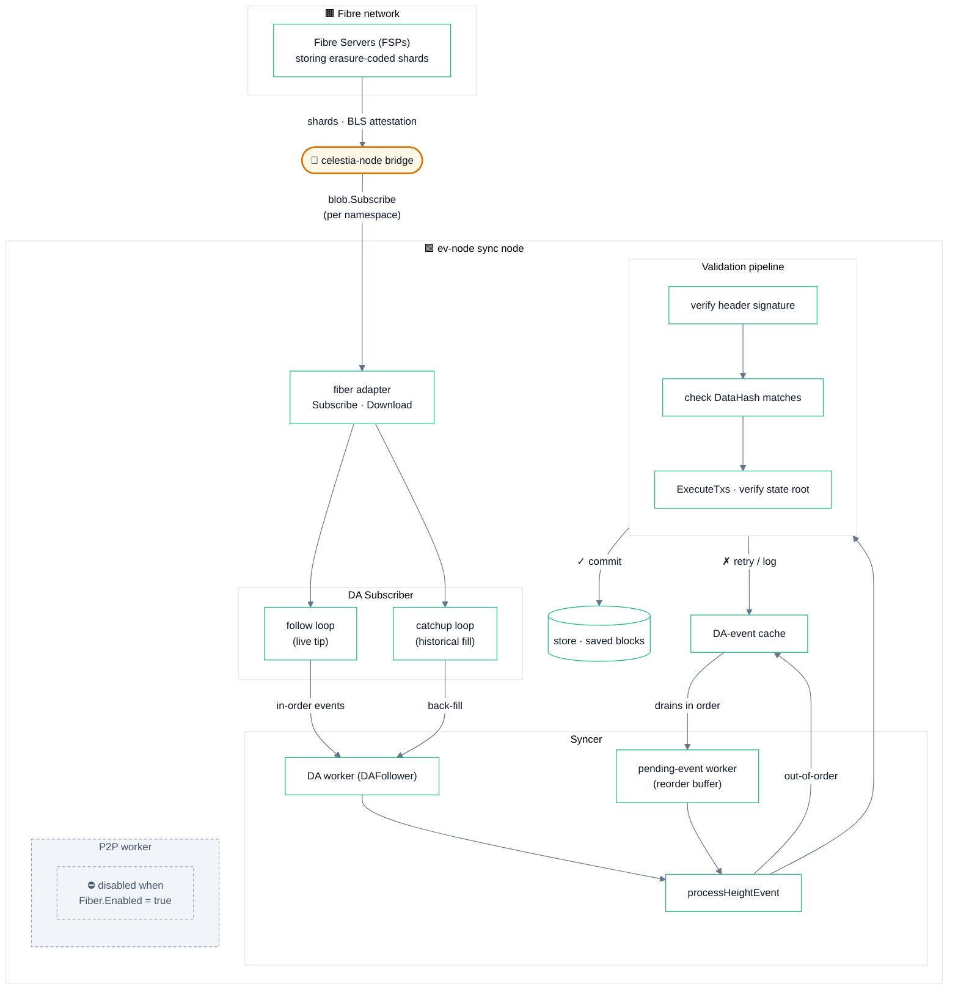

# ev-node × Fibre — Pipeline Architecture

These diagrams reflect the **post-`fibre-experiment` HEAD** state of the
upload and download pipelines. Differences from the pre-experiment
ev-node:

- 4 concurrent upload workers per stream (was 1)
- `splitByBlobSize` pre-chunks pending into per-blob-sized batchGroups
- 120 MiB `DefaultMaxBlobSize`
- Adaptive batching, 1.5 s max delay
- Syncer P2P worker disabled (Fiber covers DA delivery)
- `MaxPendingHeadersAndData = 0` — execution never blocks on uploads

GitHub renders Mermaid in-line. For local preview use VS Code's Mermaid
extension or paste into <https://mermaid.live>.

---

## 1. Upload — tx ingress through DA settlement

Heavy arrows (`==>`) mark the four batching transitions where a
collection becomes the unit of work for the next stage.

```mermaid
%%{init: {
  'theme': 'base',
  'themeVariables': {
    'primaryColor':       '#ffffff',
    'primaryBorderColor': '#3b82f6',
    'primaryTextColor':   '#0f172a',
    'lineColor':          '#64748b',
    'fontFamily':         'system-ui, -apple-system, sans-serif',
    'fontSize':           '14px'
  }
}}%%
flowchart TB

    %% ───── client ─────
    Client(["📨  client / load gen"]):::ext

    %% ───── ev-node ─────
    subgraph evnode["🟦 ev-node aggregator"]
        direction TB

        subgraph ingest["Ingress"]
            direction TB
            Inject["exec.InjectTx"]
            Chan[("buffered channel<br/>cap 10 000")]
            Inject --> Chan
        end

        subgraph reaper["Reaper · every 100 ms"]
            direction TB
            RDrain["GetTxs · drain channel"]
            SBT["SubmitBatchTxs"]
            RDrain --> SBT
        end

        SQ[("Sequencer queue")]

        subgraph producer["Block producer · every 200 ms"]
            direction TB
            GNB["GetNextBatch · drain queue"]
            ETX["ExecuteTxs"]
            Sign["sign + persist<br/>header + data"]
            GNB --> ETX --> Sign
        end

        Store[("on-disk store")]

        subgraph cache["Pending cache"]
            direction LR
            PH["headers"]
            PD["data"]
        end

        subgraph subloop["daSubmissionLoop · 250 ms tick"]
            direction TB
            Adapt["adaptive trigger<br/>80 % of blob · OR · 1.5 s"]
            Split["splitByBlobSize"]
            Adapt --> Split
        end

        subgraph pool["DA worker pool"]
            direction LR
            HCh[("headerSubmitCh<br/>cap 10 240")]
            DCh[("dataSubmitCh<br/>cap 10 240")]
            HW["4 header workers"]
            DW["4 data workers"]
            HCh --> HW
            DCh --> DW
        end

        Adapter["fiber adapter<br/>flatten + Upload"]

        Chan --> RDrain
        SBT ==>|"BATCH 1"| SQ
        SQ --> GNB
        ETX ==>|"BATCH 2 · one block"| Sign
        Sign --> Store
        Sign --> PH
        Sign --> PD
        PH --> Adapt
        PD --> Adapt
        Split ==>|"BATCH 3 · per-upload chunk"| HCh
        Split ==>|"BATCH 3"| DCh
        HW ==>|"BATCH 4 · many blocks per blob"| Adapter
        DW ==>|"BATCH 4"| Adapter
    end

    %% ───── fibre layer ─────
    subgraph fibre["🟧 Fibre network"]
        direction TB
        FSP["Fibre Server (FSP)<br/>colocated with validator"]
        PFF["MsgPayForFibre<br/>broadcast async"]
        FSP --> PFF
    end

    subgraph chain["⛓ celestia-app"]
        direction TB
        Inclusion["block inclusion"]
        Attest["BLS attestation"]
        Inclusion --> Attest
    end

    Bridge(["📡  celestia-node bridge"]):::ext

    %% ───── cross-graph edges ─────
    Client --> Inject
    Adapter ==>|"fiber.Upload (1 blob)"| FSP
    PFF --> Inclusion
    Attest -.->|"BlobEvent stream"| Bridge
    Bridge -.->|"DA-included height (Listen)"| cache

    classDef ext fill:#fff7e6,stroke:#d97706,stroke-width:2px,color:#0f172a
```



### Where each batching transition happens

| # | From | To | Where |
|---|------|----|-------|
| **1** | Loose txs in mempool channel | `[]Tx` per scrape | `Reaper.scrape` ([reaping/reaper.go](../../block/internal/reaping/reaper.go)) |
| **2** | Sequencer queue items | One block's data | `Executor.ProduceBlock` ([executing/executor.go](../../block/internal/executing/executor.go)) |
| **3** | Pending headers/data window | Per-upload chunk | `splitByBlobSize` in [submitting/da_submitter.go](../../block/internal/submitting/da_submitter.go) |
| **4** | Multiple blocks' data | One Fibre blob | `fiber.Upload` via [da/fiber_client.go](../../block/internal/da/fiber_client.go) |

### Concurrency model

- **One goroutine** per stage in the diagram boxes — they fire on independent timers and exchange data through cache/queues, never via blocking calls.
- **Block production never gates on uploads**. `MaxPendingHeadersAndData = 0` in the Fiber profile means the executor produces blocks regardless of submission backlog. The pending cache is the only place size matters.
- **4 workers per stream** in the DA pool process distinct chunks in parallel. Pre-chunking in `splitByBlobSize` ensures multiple workers actually engage instead of one swallowing the queue.
- The `BlobEvent` feedback loop from the bridge is **read-only** w.r.t. the upload path — it updates the cache's "DA-included height" tracking but does not throttle submission.

---

## 2. Download — Fibre BlobEvent through state update

The download path is purely event-driven from the Fibre side. There is
no polling; ev-node subscribes to the data namespace and reacts to each
`BlobEvent`.



### What each loop does

| Loop | Source | Purpose | Code |
|---|---|---|---|
| **Follow loop** | live tip from `Subscribe` | Process events as they arrive | [da/subscriber.go::followLoop](../../block/internal/da/subscriber.go) |
| **Catchup loop** | gap detection from highestSeen vs localDAHeight | Fill historical heights without blocking the live path | [da/subscriber.go::catchupLoop](../../block/internal/da/subscriber.go) |
| **DA worker** | `DAFollower` | Pump events into `processHeightEvent` | [syncing/da_follower.go](../../block/internal/syncing/da_follower.go) |
| **Pending-event worker** | reorder buffer | Drains out-of-order events once their predecessors have been processed | [syncing/syncer.go::pendingWorkerLoop](../../block/internal/syncing/syncer.go) |
| **P2P worker** | gossipsub topics | **Disabled** when `Fiber.Enabled` — Fiber's Subscribe path delivers everything via DA | [syncing/syncer.go::startSyncWorkers](../../block/internal/syncing/syncer.go) |

### Key invariants

- **No P2P fallback when Fiber is enabled** — the syncer doesn't even start the P2P worker, so a misbehaving peer can't inject bad headers. The libp2p host is still constructed for shutdown symmetry but no peers connect.
- **Order doesn't matter at the DA layer** — `processHeightEvent` accepts events out of order and uses the cache as a reorder buffer. Once a height's predecessor is committed, the cached event is replayed.
- **Validation is the same as the production path** — header signature, data hash, state root after `ExecuteTxs`. A sync node ends up in the same state as the producer regardless of whether blocks arrived via DA or P2P.
- **No height returned from Fibre `Upload`** — the adapter feeds `latestObservedHeight` from `Subscribe`'s `BlobEvent` stream. So the upload path's "DA-included height" lags settlement by ~the chain block time but never claims a height higher than what's been observed.

---

## Reproducing the diagrams

Both diagrams render directly in this Markdown file when viewed on
GitHub. To export as PNG/SVG locally:

```sh
# render to PNG via mermaid-cli (one-time install):
npm i -g @mermaid-js/mermaid-cli

mmdc -i ARCHITECTURE.md -o ARCHITECTURE.png   # extracts each fenced ```mermaid block
```

Or paste the fenced blocks into <https://mermaid.live> for an
interactive editor.
